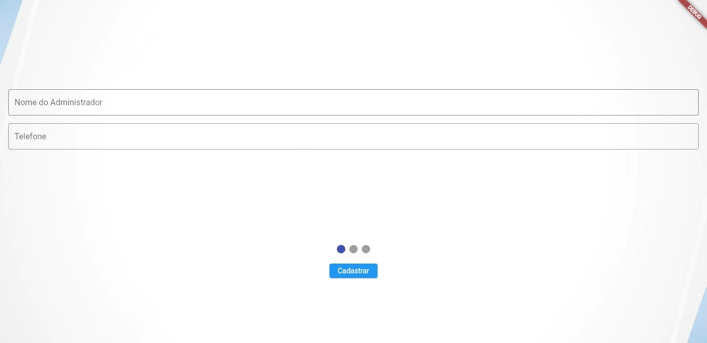
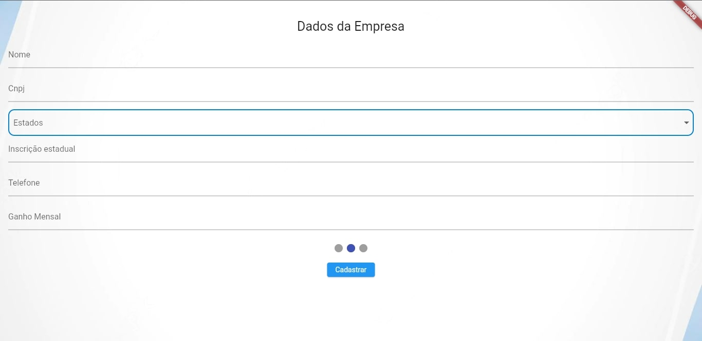
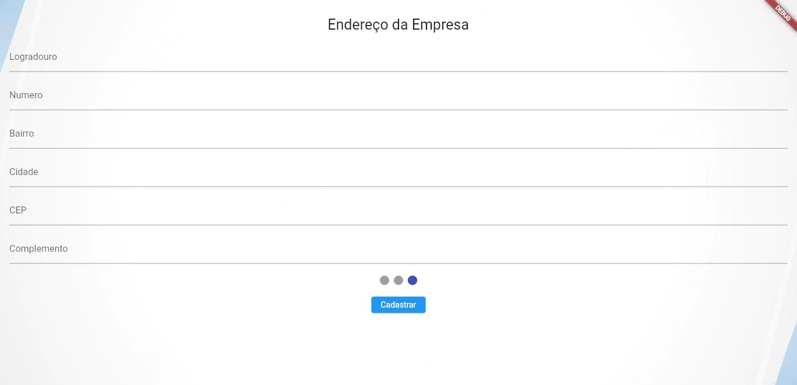

I can write content using [GitHub-flavored Markdown syntax](https://github.github.com/gfm/).

## Primeiramente

**Bold** _italic_ `code` [Links](#url)

> Donec sit amet nisl. Aliquam semper ipsum sit amet velit. Suspendisse
> id sem consectetuer libero luctus adipiscing.

>* Cadastrar :
    Nesse botão iremos para outra tela onde sera feita o preenchimento dos campos para ser salvo no banco de dados

>* Nome Administrado : 
    Nesse campo devemos informa o nome do administrador

>* Telefone :
    Nesse campo devemos informa o telefone do adminstrador

>* Nome :
    Nesse campo devemos informa o nome da  empresa

>* Cpnj :
    Nesse campo devemos informar o Cnpj da empresa, o campo possui validação de Cnpj, certifique de ter digitado certo

>* Estados :
    Nesse combo box devemos marca o estado onde se encontra a empresa

>* Inscrição Estadual :
    Nesse campo devemos escrever a inscrição estadual, o campo possui validação de inscrição, certifique de ter digitado cert

>* Ganho Mensal :
    Nesse campo deve informa o ganho mensal da empresa

>* Logadouro :
    Nesse campo devemos informa o nome do local onde esta a empresa como rua ou nome da fazenda

>* Numero :
    Nesse campo devemos informa o numero de endereço da empresa

>* Bairro :
    Nesse campo devemos informa o nome do bairro de onde está a empresa

>* Cidade :
    Nesse campo devemos informa a cidade de onde está a empresa

>* Cep :
    Nesse campo devemos informa o cep de onde está a empresa 

>* Complemento :
    Nesse campo devemos informa algum complemento para ser mas facil localizar a empresa

