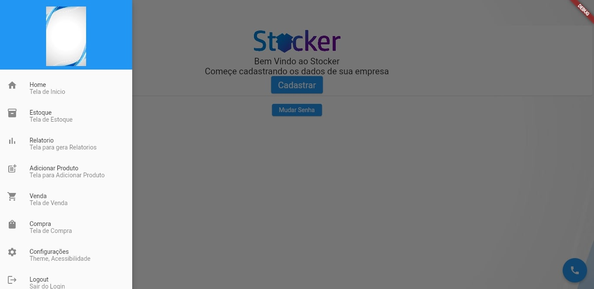

A tela de home comporta a opção de ir prar outras telas do sistema

>* Cadastro: 
    Nesse botão seremos trasferido para a tela de cadastro

>* Mudar senha : 
    Nesse botão caso o usuario perca sua senha sera possivel recuperar atras de uma validação do email

>* App bar : 
    Localizado o conto superior esquerdo, ele abre o meno para acessar outras telas

>* Comando Oor Falas :
    Nesse obtão ao acionamos ele esculta e posteriamente executa comandos no sistema, como navegar entre telas

    

>* Home :
    Nesse botão retornaremos para a tela inical home

>* Estoque :
    Nesse botão seremos trasferido para a tela de estoque

>* Relatorio :
    Nesse botão seremos trasferido para a tela de relatorio

>* Adicionar Produto : 
    Nesse botão seremos trasferido para a cadastro de produtode 

>* Venda :
    Nesse botão seremos trasferido para a tela de venda

>* Compra :
    Nesse botão seremos trasferido para a tela de compra

>* Configurações :
    Nesse botão seremos trasferido para a tela de configurações

>* Logout :
    Nesse botão sairemos da conta logada
